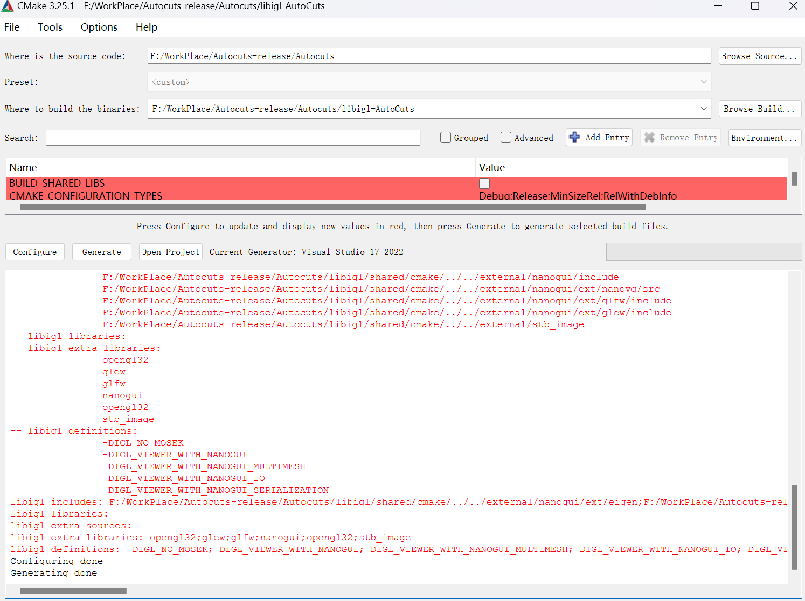
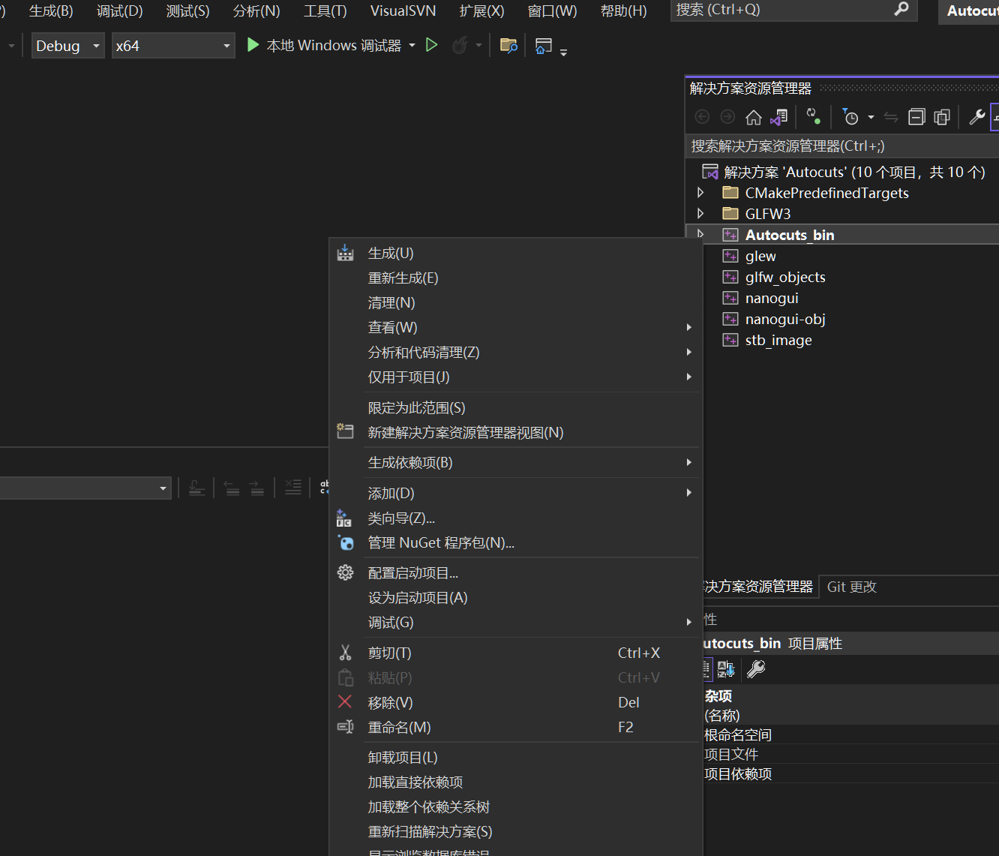
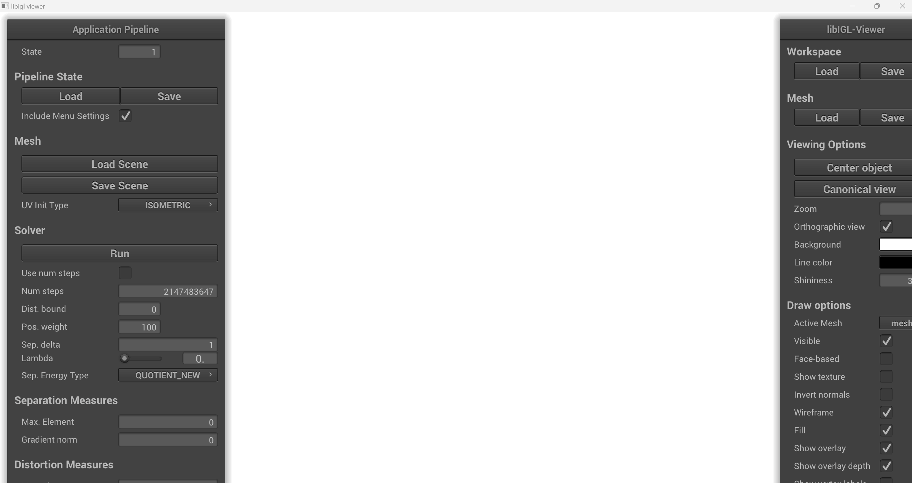

Autocuts: simultaneous distortion and cut optimization for UV mapping
===================
> 本项目为Autocuts的分支版本，由于原项目是2017年的了，其使用的部分第三方依赖库已停止维护，本项目更新和修复了原版本中的一些问题，使得其能在2024年的环境下编译和运行。

论文链接：

[《Autocuts: simultaneous distortion and cut optimization for UV mapping》](https://dl.acm.org/doi/10.1145/3130800.3130845)


中文翻译版论文：

[《自动切割时同时进行反失真和切割优化，以实现UV映射》](./docs/自动切割时同时进行反失真和切割优化，以实现%20UV%20映射.md)

原项目链接：

[Autocuts](https://github.com/Roipo/Autocuts)

## 环境依赖
- Windows10+
- Visual Studio 2022
- C++ v143 生成工具
- Cmake 3.25.1
## 配置开发环境

使用git clone 拉取
```bash
git clone https://github.com/CGandGameEngineLearner/Autocuts.git
```
打开Cmake GUI
Where is the source code: 填入当前项目路径
Where to build the binaries: 在拉取的项目文件夹下创建一个libigl-AutoCuts文件夹，填写此文件夹路径
点击Configure，选择Visual Studio 2022，执行完后再点击Generate

等待加载完毕后，在libigl-AutoCuts文件夹下可以看到生成的解决方案`Autocuts.sln`，使用Visual Studio打开它。
把Autocuts_bin设置为启动项目，在Debug x64配置下点击启动调试，即可编译并运行此项目，如下图：


运行效果如下



右侧Mesh Load按钮载入模型，本项目提供了一些模型在mesh文件夹中，可以用来使用，注意模型格式必须为obj格式.

左侧Run键运行，lamda值必须取值范围为(0,1)开区间，如果刚好为0或1可能会卡死，原理可以看原论文。

Controlling the Mesh
--------------------
LEFT ALT + MID MOUSE:
	UV & 3D -> translate
	
LEFT ALT + LEFT MOUSE:
	UV -> -
	3D -> rotate
	
Painting
--------
LEFT SHIFT + LEFT MOUSE
	UV & 3D -> more separation weight (red)

LEFT SHIFT + LEFT MOUSE
	UV & 3D -> less separation weight (blue)

LEFT SHIFT + MID MOUSE
	UV & 3D -> remove any color and set weight to 0 (white)

LEFT SHIFT + MOUSE SCROLL
	UV & 3D -> Smaller/Larger intersection circle
	
Positional Constraints
----------------------
LEFT CTRL + CLICK LEFT MOUSE
	UV -> Fix/release constraint (green)
	
LEFT MOUSE (DOWN/DRAG)
	UV -> ADD/UPDATE constraint (blue)
	
LEFT MOUSE UP
	UV -> RELEASE constraint
	
Edge selection
--------------
(should not be needed with proper painting)
	
TAB + LEFT MOUSE
	UV & 3D -> Remove separation influence (green)
	
TAB + RIGHT MOUSE
	UV & 3D -> Higher separation influence (cyan)
