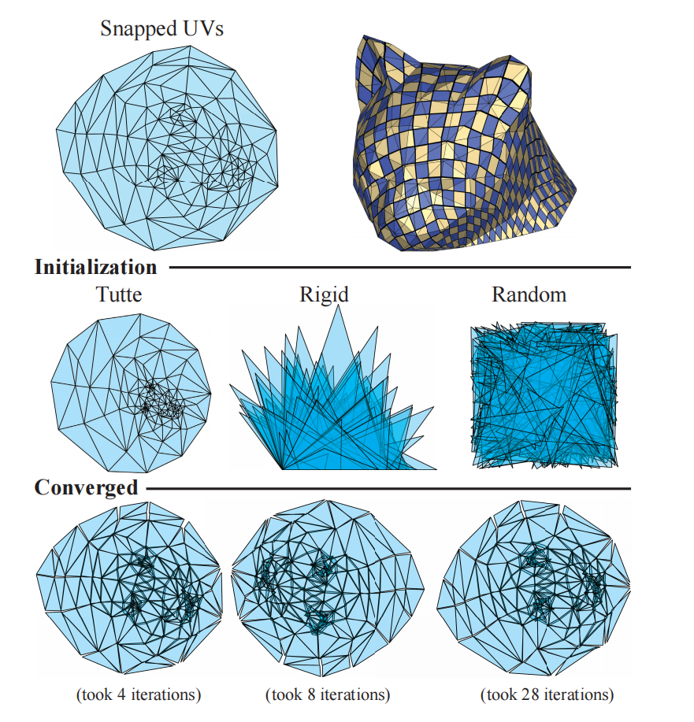
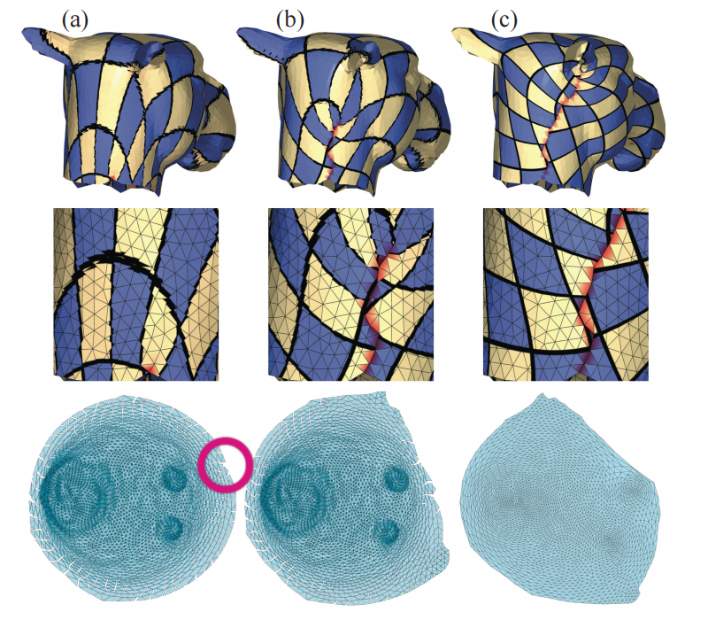

# 自动切割时同时进行反失真和切割优化，以实现 UV 映射
> 作者：
ROI PORANNE, ETH Zurich
MARCO TARINI, CNR-ISTI and Univ. Insubria
SANDRO HUBER, ETH Zurich
DANIELE PANOZZO, New York University
OLGA SORKINE-HORNUNG, ETH Zurich


```
图 1. 我们的方法生成高质量的 UV 贴图，平衡接缝数量和贴图的扭曲。该方法以交互速率运行，并且
如果需要，可以为美工人员提供对 UV 贴图的完全控制权。我们提供交互式工具，例如用于打包岛的边界框（左）、绘制
吸引或阻止接缝创建的区域，以及半自动删除重叠区域。每个工具都提供交互式反馈，效果显著
简化复杂 UV 贴图的设计。
```

### 前言

我们提出了一个UV映射算法，联合优化的切割和失真，避免了启发式放置切割。我们最小化的能量是一种最先进的几何失真度量，推广到考虑接缝。我们的算法旨在支持一个交互式工作流：它动态优化UV地图，而用户可以交互式移动顶点，切割网格部分，连接接缝，单独的重叠区域，并控制参数化补丁在UV空间中的位置。我们的UV贴图在几何失真和切割放置方面都是高质量的，并优于那些设计的传统建模工具。与现有方法一样，我们的紫外线映射可以在一小部分时间内创建，因为我们的算法大大减轻了困扰传统UV映射方法的试错迭代过程。

### 1. 介绍
UV图在计算机图形学中被广泛使用，用于将定期采样的二维数据，如颜色、法线或位移，映射到嵌入在3D中的表面上。在过去的三十年里，UV图的设计受到了研究界的广泛关注。它传统上分为两个步骤：最优切割的计算，也称为接缝，以及尽量减少结果补丁被映射到平面上时的失真。这两个子问题在本质上是非常不同的：前者是离散的和组合的，因为切割是从一个离散的网格体边集中选择的，而后者是连续的，因为扭曲取决于网格顶点的UV坐标。切割通常首先计算，并严重影响结果参数化的质量；如果UV映射的质量不足以满足预期的应用程序，用户必须改变切割并重新运行参数化计算机，可能会重复这个试错循环几次。切割通常首先计算，并严重影响结果参数化的质量；如果UV映射的质量不足以满足预期的需求，用户必须改变切割并重新运行参数化计算机, 可能会重复试错几次。

我们提出了第一种方法来共同优化切割和几何失真。我们的算法最小化最先进的失真措施在交互速率，同时识别一组足够的网格边缘来切割。虽然以前的方法优化了切割或失真单独，我们的公式自动引入切割，并在同一能量优化过程中最小化失真。我们的算法的关键思想是通过单独参数化每个三角形来建模UV映射，使用吸引能量来鼓励参数化在匹配的边对上是连续的。吸引能量上的稀疏性诱导范数只导致少数边缘对不合并，而这些是最终的UV图的接缝。直观地说，这对应于经典的接缝二进制概念的松弛：在优化过程中，我们不是将每条边标记为接缝或正则边，而是允许它介于两者之间。随着算法的收敛，这些边缘会越来越接近接缝边或规则边，直到它们足够接近，可以被“捕捉”到两个选项中的一个。

虽然我们的算法已经在自动模式下有用，它的优势是支持数字艺术家首选的交互式工作流：我们的优化运行在后台，而用户可以交互移动顶点，切割网格部分，连接接缝，删除自我重叠区域和包装产生的补丁在紫外线空间（见图1和伴随的视频）。所有这些约束都可以是困难的，覆盖了我们的算法所支持的能量最小化决策，也可以是软的，引导优化朝着所需的方向发展。

我们希望我们的算法会影响UV图的设计，因为它消除了目前常见的令人沮丧的试错工作流。此外，它还提供了一个交互式界面，使艺术家能够手动指定地图的语义相关部分，同时在后台自动处理剩余的优化。我们提供了我们的方法的参考和开源实现（见第4节），以确保我们的结果的可复制性，并鼓励集成到现有的工具中。

### 2. 相关工作
曲面参数化，即UV图构造，在文献中被广泛涵盖[Hormann等人，2007；Sheffer等人，2006]。计算切割和最小化失真的子问题已经被广泛的研究——然而，大多是分开的。

### 2.1 最小化失真
大部分应用要求参数化映射尽可能地保持等距，即尽可能多地保持角度和面积。大量的失真的措施已经被提出来量化一个给定的映射和等距之间的差异。所选择的失真测量通常是通过每个顶点UV分配空间上的UV映射进行优化的。

保形失真度量，只惩罚角失真，可以表示为紫外变量的二次函数[Desbrun等人，2002；Levy等人，2002]，导致稀疏最小平方问题，这是非常有效的解决。不幸的是，同样考虑面积的失真测量（例如[霍曼和格林纳2000；Liu等人2008；Sander等人2001])是非线性和非凸的，因此难以最小化。这引发了寻找好的算法和数字解决方案的研究。

在最成功的方法中，局部/全局优化[Liu et al. 2008]交替计算完美等距但不连续映射，并通过全局优化拼接创建连续但不再等距映射。我们的方法借鉴了富有成效的想法，分配每个角点变量给每个顶点，每个事件三角形一个，有效地分离UV空间中的每个三角形。

最近的研究制定了复杂的和高度非凸的目标函数，能够通过连续优化找到几乎等距和无可逆的参数化，通过最小化迭代更新的凸代理[Kovals基等人2016；拉宾维奇等人2017；史密斯和谢弗2015]。我们建议采取另一个飞跃，并在同一目标函数中包括切割优化和一个最先进的失真度量。这是微不足道的，因为削减优化和失真最小化有截然不同的行为：后者倾向于传播误差同样在表面，而前者必须集中误差在一个离散集（削减顶点），让它在零，由于切割的二进制性质。因此，直观地说，一个同时容纳切割和低失真的目标函数必须是非常非凸的。

### 2.2 优化切割
尽管对网格参数化进行了广泛的研究，但切割的自动计算仍然是一个开放的问题。许多参数化方法都接受切割作为输入，并计算具有一个或几个磁盘拓扑结构的曲面的映射。早期的方法也要求指定UV域中的切割形状（例如[Floater 2003]）。最近的自由边界方法优化了整个二维补丁的形状，包括边界（例如[Desbrun等2002；列维等2002；刘等2008；Sheffer等2005])。目前的工作成功地避免了局部和全局的自交，同时保持了边界自由和最小化等距失真测量[Smith和Schaefer 2015]。

在一些工作中，切被确定为参数化过程的一部分。它们可以大致被分为三个不同的组，具体情况如下。

为重新契合应用而削减。最近的大部分参数化文献倾向于关注四边形重划分的应用，而我们对纹理映射感兴趣。在重新划分网格的参数化中，切割放置在很大程度上是无关紧要的，只要UV空间中每一个切割的两边匹配，直到旋转π/2的整数倍和平移步骤。具有这种属性的切割有时被称为“可网格化”，因为它可以被网格无缝地穿越，然后参数化被称为“无缝化”。因此，在重新划分时，关于良好的放置位置的问题经常被忽视（例如，见[Bommes等人2009年]和调查[Bommes等人2013年]）。锥形奇点的放置，可以被理解为可网格切割的端点，仍然是至关重要的，并且可以作为单独优化的主题[Ben-Chen et al. 2008；Myles和Zorin 2013]。一些工作优化网格上可网格切割的位置（从锥开始），如直线或场对齐和短[凸边和工作带2014；Tarini等人2011]。奇点图的交互式设计[Takyama等人2013；Tong等人2006]也可以被视为规定可网格切割的一种特殊方式。不幸的是，在传统的纹理映射应用中，可网格切割不那么有用，并且施加了只必要的四边形网格情况下的不必要的约束。尽管它们可以为特定类型的纹理映射提供一定的好处[Ray et al. 2010]，但可网格切割并不是严格要求的，也很少使用，例如在游戏行业。一个关键的原因是，一般的切割，而不是可网格的切割，它的重要目的是用补丁内的高斯曲率来换取其边界上的线曲率，从而减少失真。这种考虑是基础。

增加切割，同时尽量减少失真。许多方法产生新的切割，作为对抗过度局部扭曲的手段。一种方法是在最小化失真能量和在失真超过某一阈值时贪婪地放置额外切割之间交替，见[Gu等2002；Sorkine等2002]。另一种方法是首先通过分析高斯曲率和可见性来确定良好的切割候选位置，见例如[Ben-Chen等人，2008；Sheffer和Hart，2002]。所有这些方法都试图平衡失真和切割作为同一迭代过程的一部分；然而，与我们的方法不同，切割的放置依赖于启发式，而不是直接成为映射的全局优化的一部分。

通过网格划分生成切割。在30多年的发展过程中，许多参数化方法将初始网格用磁盘拓扑划分为单独的补丁（即单独的连接组件），从而将切割定义为分区的边界。划分可以考虑各种不同的因素，例如根据特征聚集三角形[张等人2005]，法线[梅洛等1993]或可开发性标准[朱利叶斯等2005]，播种和扩展区域[列维等2002]，计算表面的中心镶嵌[博尔-马丁等2004]，简化网格并使用基础网格的多边形来定义图表[霍达科夫斯基等2003]，跟踪交叉场后的切割[驼峰和背带2014]，或遵守曲面的弯曲骨架[Usai等人。2015]（这个列表中的每个项目都有一个引用）。虽然这些方法背后的选择都是受到关于其对最终参数化质量的影响的有效的、一般的考虑的启发，但先验假设是间接的，不能期望导致最优的UV图。通常，这些补丁往往比理想的补丁更小、更多。另一个限制是，通过构造，切割只能出现在属于不同补丁的元素之间。这就施加了一个人工约束，这在许多良好的剪切布局中经常被违反，例如典型的人工设计的布局，其中剪切也可以自由地出现在属于同一补丁的多边形之间。

绕过了削减开支的需要。纹理映射研究的长期趋势努力绕过而不是解决识别良好切割的任务[塔里尼等人2017]，通过提供完全替代二维参数化和二维纹理映射[本森和戴维斯2002；伯利和拉斯韦尔2008；克里斯坦森和巴塔利2004；2006年列斐伏尔和霍普2006；塔里尼等人2004年；尤克塞尔等人2010年]，或使他们的定位不那么重要甚至无关紧要[列费伏尔和达赫斯巴赫2007；普诺莫等人2004；雷等人2010年；塔里尼2012,2016]。所有这些方法都提供了新的视角和权衡。与此同时，该行业几乎一致支持传统的紫外线和纹理贴图，可能是因为它们提供的好处，目前没有任何替代方案与之完全匹配。除了熟悉，这些包括内容创建方面：通用性、完整的适应性，富有成效的类比纹理和传统的2D图像（利用各种方式，如直接绘画2D纹理），和渲染方面：简单、时间效率和资源，最重要的友好，应用过滤器和预过滤（MIP映射）。基于所有这些原因，我们认为，在UV映射中定义良好的切割的问题仍然是高度相关的。

现有的手动切割放置工具。在图形相关的行业，产生UV映射的任务总是计算机辅助而不是全自动的；失真最小化成功地委托给自动算法，而切割的放置通常需要训练有素的数字艺术家手动干预。所有现代建模包都提供了专门的接口和复杂的交互工具，但该任务仍然很耗时（参见随附的视频）。如果输入网格是不规则的，那么由于UV映射器不能快速选择连续的边（即所谓的边循环）作为切割，难度就会增加。我们的方法提供了一个改进，因为它消除了完全手动切割选择的必要性，并且不依赖于网格连接的规律性。

### 3. UV优化方法
UV映射的一个目标是参数化一个具有最小的失真和最小的切割长度的网格。一个极端是做必要的最小切割来诱导磁盘拓扑，这导致高度扭曲的三角形对纹理映射应用程序无用，而另一个极端是在所有内部边缘上放置切割，这样每个三角形的映射没有任何扭曲[Burley和Lacewell 2008]。在这项工作中，我们提出了一种交互式地探索求解空间的方法。

在我们的公式中，我们将原始网格视为一个三角形汤，其中每个三角形都与其他三角形分开。每个内边都被复制，并在三角形汤中出现为两个副本。每个顶点根据其度复制多次，副本称为角。我们用$v_i、e_j、f_k$来表示原始网格的顶点、边和面，并使用下标$i、j、k$来指代与顶点、边和面相关的量。例如，$a_k$是面片的面积, $l_j$是边$e_j$的长度。我们使用混合下标来识别三角形汤中的边副本和角。比如，$e_{jk}$指和面$f_k$相关的边$e_j$的副本，$v_{ik}$指源于$v_i$并且在面$f_k$中的角顶点。我们优化的变量是UV空间中的角的位置，表示为$X$ = {$x_{ik}$ = （$U_{ik}$ ，$V_{ik})$} 。最后，我们使用$f_k (X)$来引用所有与$f_k$相关的变量，也就是面$f_k$的三个角UVs $x_{ik}$。（类似的还有$e_j(X),e_{jk}(X)$等等）


三角形汤的参数化是指每个三角形到该平面的映射。当一条边的两个副本被分开且不完全重合时，就会发生切割。在最广泛的意义上，我们的方法包括解决以下优化问题：
$\mathop{min}\limits_{X} E(X) = min (1-\lambda)D(X)+\lambda S(X)$
其中E为总目标函数，D为失真目标（如保留角度或面积），S为分离目标，参数λ控制两个目标之间的平衡（图2）。这两个目标分别被定义为对面和边的加权和：
$D(X) = \sum\limits_{face\,k} A_k E_d (f_k(X))$,..............(1)
$S(X) = \sum\limits_{edge\,j} l_j E_s (e_j(X))$,..............(2)

其中$E_d$为三角形失真度，$E_s$为边缘分离度。而失真措施在以前的工作中已经被彻底讨论过(小节2)、与分离措施相关的相关工作较少。确定一个适当的这种措施是这项工作的主要挑战之一。我们接下来讨论我们的选择，并简要地讨论失真措施。

分离措施。给定一个位于UV空间的边缘的两个副本，我们的目标是找到一个有意义的测量它们的分离。在不连续伽辽金方法领域也讨论了一个类似的问题[Cockburn et al. 2000],使用不符合（即不连续）有限元素。Babuska和Zlamal [1973]提出测量沿边缘跳跃的L2范数。一种更现代的方法使用数值通量的概念，它通常被定义为平均的积分和关于边的函数的差的组合[Arnold et al. 2001]。最近，另一种分离方法出现在[Fu和Liu 2016]中，用于计算双射映射。这种度量称为边装配约束，本质上是两个边向量之间差的范数。


在我们的设置中，我们观察到，当考虑切割时，一条边可以有三种不同状态中的一种：它可以未切割，半切割（其中一个端点顶点分裂，而另一个没有），也可以完全切割（见插图）。上述措施不能区分完全切割状态和半切割状态。相反，我们建议独立地考虑每个边端点上的每一对角。也就是说，分离度量包括两对端点之间的距离。更准确地说，让$f_{k1}$和fk2是两个与两个端点$v_i$，$v_i$.共享一个边$e_j$的面我们定义了一个应用于两对$v_{ij}(X)$和$v_{i'j}(X)$的角分离测度，即，在ej的端点上的两对角：

$E_s(v_{ij}(X) = s(||x_{iki} - x_{ik_2}||))$,

$E_s(v_{i'j}(X) = s(||x_{i'ki} - x_{i'k_2}||))$,
`公式3`

其中，$s(.)$是后面定义的单调权值函数。然后我们在等式(2)中重写了这个问题具体内容如下：


$minimize \, for \, X \, E(X) = (1 - \lambda) \underbrace{\sum_{\text{face } k} A_k E_d(f_k(\mathbf{X}))}_{D(\mathbf{X})} + \lambda \underbrace{\sum_{\{i, k_1, k_2\} \sim j} l_j s(\|\mathbf{x}_{ik_1} - \mathbf{x}_{ik_2}\|)}_{S(\mathbf{X})}, $

其中第二和在所有角$v_{ij}$和面对$f_{k1}$，$f_{k2}$入射到边缘ej。我们定义$s(.)$来实现两个目标： (i)为我们想要有尽可能少的切割，以及（ii）如果一条边被切割，就没有理由鼓励它的两个副本在UV域中保持彼此的空间接近。满足这些需求的理想函数是：
$s(t) = 
\begin{cases} 
0, & t = 0 \\
1, & \text{otherwise}.
\end{cases}$
对于s的选择，方程(4)是一个$L_{0}$-正则化的优化问题，这通常很难直接解决。在下文中，我们将讨论使用同伦优化来解决它的方法。

扭曲度量。由于大多数纹理映射应用倾向于等距映射，我们在本文的所有结果中使用了对称Dirichlet能量[Smith和Schaefer 2015]，其定义为：
$$E_{d}\left(f_{k}(X)\right)=\left\|J_{k}\left(f_{k}(X)\right)\right\|_{F}^{2}+\left\|J_{k}^{-1}\left(f_{k}(X)\right)\right\|_{F}^{2},$$

其中，$J_{k}\left(f_{k}(X)\right)$ 是面 $f_{k}$ 上映射的雅可比矩阵（Jacobian），而 $\|\cdot\|_{F}$ 是弗罗贝尼乌斯范数（Frobenius norm）。这个度量对于旋转确实是最小的，并且它还具有几个额外的有利特性。首先，它对反转元素进行无限惩罚，从而防止它们出现。其次，由于它只需要很少的基本操作来评估，因此在计算上是高效的。如果特定应用需要，我们的算法只需进行最小的修改，就可以轻松地最小化其他能量，例如保形AMIPS[Fu et al. 2015]。


### 3.1 同伦优化

通过上述分离和扭曲能量的选择，方程(4)变得非光滑且非凸。因此，直接最小化它是困难且计算成本高昂的。然而，诸如迭代加权最小二乘法[Daubechies et al. 2010]、L1松弛[Boyd and Vanderberghe 2004]以及同伦优化方法等实用算法对此类能量表现良好。我们采用了与后者相似的方法，如下所述。

同伦优化技术，也称为延续方法[Allgower and Georg 2003]，是一种解决高度非凸问题的技术。与分级优化和确定性退火[Rose 1998]等方法类似，它通过平滑目标函数，然后逐渐恢复其锐度来消除许多局部最小值[Mobahi and Fisher 2015]。在每次迭代中，算法找到一个局部最小值，使用前一个最小值作为起点（见图3左侧的草图）。具体来说，给定一个目标函数 $E(X)$，该方法需要一系列函数 $E_{\delta}(X)$，其中参数 $\delta>0$ 控制平滑度，使得 $\lim_{\delta\rightarrow 0} E_{\delta}(X)=E(X)$；$\delta$ 在每次迭代中根据特定策略更新（稍后介绍），直到收敛。见下面的算法1。


算法 1：同伦优化  算法 1：同伦优化 
输入： 
$E_{\delta}(X), \delta>0, \text{ 使得 } \lim_{\delta\rightarrow 0} E_{\delta}(X)=E(X)$ 
$\delta \leftarrow \delta_0$
$X^{(0)} \leftarrow \arg\min_{X} E_{\delta}(X)$ 
$n \leftarrow 1$
当未达到标准时执行更新根据策略更新 $\delta$
    $X^{(n)} \leftarrow \arg\min_{X} E_{\delta}(X)$ 使用 $X^{(n-1)}$ 作为初始化 
    $n \leftarrow n+1$


>图3. 左侧：同伦优化。目标函数E首先被彻底平滑以获得$E_{\delta}$（顶部）；然后它被迭代地恢复锐度，并从先前的最小值开始优化，以找到新的最小值。随着$\delta$变小，$E_{\delta}$接近原始的E，并且找到的最小值收敛到E的最小值（底部）。右侧：我们的平滑近似$s_{\delta}(t)$（彩色曲线）和用于分离度量的不连续函数s(t)（黑色）的图表。随着$\delta$接近零，$s_{\delta}(t)$变得更加锐利并接近s(t)。

无缝 L0 惩罚。由于方程(4)的问题性非凸性源于 s(t) 的定义，我们需要找到一族适当的函数 s_δ(t) 来平滑地逼近它。Li 等人[2012] 提出了这样一种平滑近似，称之为无缝 $L_{0}$ 惩罚。受到他们提议的启发，我们定义了以下近似（图3，右侧）：

$$s_{\delta}(t) = \frac{t^2}{t^2 + \delta}. \qquad (6)$$

参数 t 被平方，使得 s_δ(t) 在零点可微。很容易验证 $\lim_{\delta \to 0} s_{\delta}(t) = s(t)$；尽管函数 s_δ(t) 并不是全局凸的，但它们在原点的一定距离内（由闭式公式定义）是凸的，并且比不连续的 s(t) 容易最小化得多。

参数 δ。标准的、完全自动的延续方法只有在 $E_δ$ 和更新 δ 的策略满足特定条件时，才能保证收敛到全局最小值 [Allgower and Georg 2003]；相反，我们选择了一个交互版本，其中 δ 作为一个参数留给用户，用户可以操纵它来引导优化朝着他们心中的目标前进。δ 对最终 UV 映射的影响在图4中展示。在基本的工作流程中，用户从一个相对较高的 δ 开始；在这种情况下，所有边缘都被切割，但角落对仍然保持紧密。结果在许多情况下与单片参数化非常相似（如果角落被重新拼接在一起）。随着用户减小 δ，一些角落对保持接近，但其他角落开始分离，产生可见的切割。进一步减小 δ 会使角落聚集在一起，使映射沿着它们的边缘连续，而剩余的角落停止相互影响。

### 3.2 数值优化

为了求解方程(4)，我们使用牛顿法结合线搜索。在每次迭代 n 中，当前迭代值为 X^(n)，我们求解牛顿搜索方向 p^(n)：

\[ H_E^{(n)} p^{(n)} = -g_E^{(n)}, \]

即，

\[ \left((1 - \lambda)H_D^{(n)} + \lambda H_S^{(n)}\right) p^{(n)} = -(1 - \lambda)g_D^{(n)} - \lambda g_S^{(n)}, \]

其中$g_E^{(n)}, g_D^{(n)}, g_S^{(n)} $和 $ H_E^{(n)} $, $ H_D^{(n)}$, $H_D^{(n)}$是总能量E的梯度和差，分别在 $X^{(n)}$ 处计算总能量 E、扭曲能量 D 和分离能量 S。然后我们通过以下方式获得下一个迭代值：

$$X^{(n+1)} = X^{(n)} + \alpha p^{(n)}, \qquad (9)$$

其中步长 $\alpha$ 通过线搜索确定；我们采用 Smith 和 Schaefer [2015] 的策略，确保没有三角形翻转。

为了找到 D(X) 的梯度和 Hessian 矩阵，我们遍历每个面，并使用 [Shtengel 等人 2017] 的方法累积每个面的梯度和修改后的 Hessian 矩阵。这确保了整体修改后的 Hessian 矩阵是正定的，同时避免了对每个面 Hessian 矩阵进行昂贵的 SVD 计算，这在 [Fu 和 Liu 2016] 中已经完成。对于分离函数 S(X)，我们在附录 A 中推导出 $s_{\delta}$ 的梯度和正修改 Hessian 矩阵的闭式表达式。

### 4 框架实现与结果

实现与性能。我们在一台12核、2.7 GHz的Xeon服务器上进行实验，使用PARDISO求解器[Kuzmin et al. 2013; Schenk et al. 2008, 2007]来解决方程(8)中的线性系统。对于我们实验的网格尺寸，性能大致呈线性扩展，一次迭代需要15毫秒处理3K个三角形，大约100毫秒处理20K个三角形。一个参考的开源实现可在 https://github.com/Roipo/Autocuts 获取。

参数调整。优化过程在后台无限期运行，直到用户准备保存结果。我们允许用户交互式地控制参数 δ 和 λ。参数 λ 初始化为0，并在[0,1]范围内自由控制。δ 初始化为1，并通过减半或加倍来修改。

初始化。由于我们将输入网格视为三角形汤，可以通过在平面上单独放置三角形并进行刚性变换来简单地初始化UV映射：我们的扭曲能量是旋转不变的，因此所使用的特定变换不会影响其最小值。我们的方法对不同的初始化极其稳健，如图5所示。

完成UV映射。一旦用户对结果满意，我们生成一个除了接缝处外都是连续的UV映射。为了实现这一点，我们遍历所有角落对，并在它们的分离能量低于0.5时将它们统一到它们的平均值（参见图5和7）。UV映射也被均匀缩放和平移到适合标准[0,1]²纹理空间。

无辅助切割。我们的方法可以在没有用户输入或只有很少输入（λ和δ值）的情况下实现高质量的结果（参见图17获得的UV映射示例）。相比之下，专业艺术家必须在最先进的软件中提供大量的手动输入才能为UV映射切割网格。据我们所知，最先进的UV映射商业工具是ZBrush的UVMaster[Pixologic 2017]。这个工具允许用户绘制应该出现或避免切割的区域，然后提供一个映射；然后用户需要重新绘制这些区域，直到获得所需的结果。根据我们使用这个工具的实验，我们怀疑切割是在参数化切割网格之前预先计算的。我们在无辅助模式下将我们的方法与UVMaster进行比较，后者在Bumpy Cube上有大量用户输入，如图6所示：我们的方法在切割和扭曲之间适当平衡，并将切割放置在立方体的“边缘”上，而ZBrush的结果似乎有些随机。更多结果请参见图17。


### 辅助切割
在许多情况下，用户希望在特定区域创建（或避免）切割。我们通过允许用户选择应在分离目标中修改权重的边缘来实现这一点，用户可以通过点击或绘制来选择。鼓励切割的实现方式是减少（或增加）优化问题中方程(4)的两对角的相关项的权重。我们观察到，在许多情况下，只需沿着单个边缘播种一个切割，其余的切割就会在优化过程中自行传播（见图7）。此外，我们允许用户通过拖动来简单地变形、撕裂和附加UV岛（参见，例如，图1和附带的视频）。

### 边界矩形
在许多情况下，要求UV形状被某个UV矩形所限制是有用的。这可以提高纹理空间效率并有助于打包。我们在UV空间中启用了边界矩形的交互式绘制和操作，并在目标函数中添加了一个软约束，作为一个“盒子”能量B，惩罚位于相关矩形R外的UV角位置。我们将B添加到我们的(4)目标中，具有一定的权重 $\beta$（在我们的系统中我们使用了 $\beta=100$）。具体来说，R被定义为两个给定区间的笛卡尔积，$R=[\underline{u},\bar{u}]\times[\underline{v},\bar{v}]$，而B是所有受影响的UV位置 $x=(u, v)$ 的总和，

$$c(\underline{u}, u) + c(u, \bar{u}) + c(\underline{v}, v) + c(v, \bar{v}) \quad (10)$$




> 图5. 我们的方法对不良初始化具有极强的鲁棒性。从 Tutte（左）开始，每个三角形在 UV 平面上进行刚性变换（中），以及完全随机的位置集合（右）所得到的结果几乎相同（除了旋转和平移的差异）。在本文的所有结果中，我们使用了中间的方法，因为它的效率和简单性。


图6. 使用我们的方法对Bumpy Cube进行自动UV映射的结果，无需用户交互并使用默认参数设置，这在立方体边缘产生了直观的切割。相比之下，即使在我们通过手动绘制候选区域（右下角的紫色区域）提供了广泛的手动建议的情况下，ZBrush的辅助UV映射也无法找到这个切割。



> 图7. 在许多情况下，手动切割一条边会触发完整切割线的创建。(a) 用户在高亮区域强制切割一条单边。(b) 切割自动在网格中传播，显著减少扭曲。(c) 最终结果。


> 图8. 左侧：无约束参数化；右侧：添加边界矩形约束。

其中 $c(a, b)$ 是一个 $C^{1}$ 函数，用于惩罚 $a>b$ 的情况：

$$c(a, b)=\left\{\begin{array}{ll}0,& a\leq b\\ (a-b)^2,& a>b\end{array}\right.\qquad(11)$$

请参见图8和附带视频，了解使用边界矩形的示例。

### 四边形网格的UV映射
我们的方法还支持设计四边形或多边形网格的UV映射，这在图形社区中很常见。由于扭曲度量是为三角形定义的，我们简单地对所有多边形进行三角化，并通过将其关联的分离能量项的权重增加100倍来防止引入的边缘分离（见图12）。

### 不规则网格的UV映射
在一些应用中，如视频游戏建模，与几何处理形成鲜明对比的是，具有高度不规则面和非标准拓扑的网格是可以接受的。由于我们的方法将网格视为三角形汤，我们可以在没有任何特殊考虑的情况下处理这类网格。在图10中，我们展示了一个不规则网格的例子以及我们使用系统获得的UV。请注意，尽管它看起来像是一个单一的流形，但网格实际上由许多连接的组件组成，因此在UV映射中我们得到了许多补丁。

与 [Sorkine et al. 2002] 的比较。我们通过实验将我们的方法与 [Sorkine et al. 2002] 进行比较。这种方法也以低扭曲和少量切割为目标，但以一种贪婪的方式进行。从单个等距参数化的三角形开始，该方法向其添加更多三角形以创建一个补丁，除非这样做超出了扭曲界限或产生自交。当无法添加额外的三角形时，当前补丁被最终确定，并从另一个三角形开始新的补丁。在图11中，我们展示了在章鱼网格上的结果，指定的扭曲界限为3，面积与周长比为10000；该映射被过度分割，并包含许多由单个三角形或短三角形条带组成的补丁。相比之下，我们交互式系统获得的结果具有更少且形状更好的补丁。

去除自重叠。纹理映射要求映射中没有全局重叠（以及局部重叠，即三角形翻转，这可以通过我们的能量函数来防止）。我们对于满足这一要求没有提供任何进展。现有的全自动技术，如 [Smith and Schaefer 2015]，在优化过程中防止全局重叠的出现，但这需要一个有效的、无重叠的映射作为起点，并且映射在所有中间阶段都必须保持无重叠状态，这不必要地限制了解决方案空间并阻碍了交互式UV映射的制作。相比之下，在传统的交互式UV制作套件中，全局重叠由数字艺术家处理，例如通过手动分割自重叠的图表。我们的交互式框架也可以用于此目的。不同的是，在我们的情况下，识别额外切割的适当位置的任务可以利用我们框架的辅助工具，这些工具有利于良好的切割；例如，可以使用撕裂手势来达到这个目的（见图1和附带视频）。图11和14-16展示了以这种方式构建的无重叠UV映射的示例。许多传统套件还提供了可选的单触工具，用户可以随时调用这些工具来修复当前的全局重叠，使用一些自动启发式方法；结果很少立即可用，需要手动调整；不过，这通常比从头开始去除重叠要快。我们的框架也可以集成类似的功能。在我们的原型中，我们尝试了一种基于 [Sorkine et al. 2002] 的贪婪过程（见图11，右）：从任意种子三角形开始，我们以广度优先的顺序访问网格，避免那些会在UV中越界任何已访问三角形的三角形（与 [Sorkine et al. 2002] 一样，这个测试只影响访问区域的边界，使其高效）；当无法添加新的三角形时，我们从一个新的种子开始，如此循环直到所有三角形都被访问。

切割长度与切割次数。默认情况下，我们通过在方程(1)中按边长加权分离度量来最小化切割的总长度。这反映了与切割相关的应用惩罚，例如纹理复制或出血伪影，这些可以被认为是与长度成比例的。其他惩罚，如顶点复制的需要，更与切割边的数量有关。我们可以选择通过给所有边赋予权重1来最小化这个数量，而不是总长度。这可能会导致不同的结果（见图13）。


> 图9. 从左到右：使用我们的工具，用户可以选择一个最大的非重叠区域并将其移开，以解决重叠问题。底部：带有纹理的最终非重叠UV。


## 5 限制和总结性评论

我们提出了一种算法来解决参数化设计中的一个核心挑战，即在单一能量函数的统一最小化过程中识别切割和最小化扭曲展开。与之前的方法相比，这是一个显著的、定性的改进，之前的方法中这两个问题是通过级联或交替解决的。我们的框架使得整个交互式UV映射创建过程更快、更直观。我们推测，基于我们方法的商业级软件套件将进一步改进它。我们邀请专业艺术家使用我们的软件进行实验，并收到了积极的反馈。初步实验表明，我们的方法可以显著加快手动UV映射的过程。虽然它确实需要对UV映射流程进行轻微的重新调整，但艺术家们表示有兴趣在未来的UV映射任务中使用我们的方法，探索其局限性，并为我们提供案例研究以供未来发展。